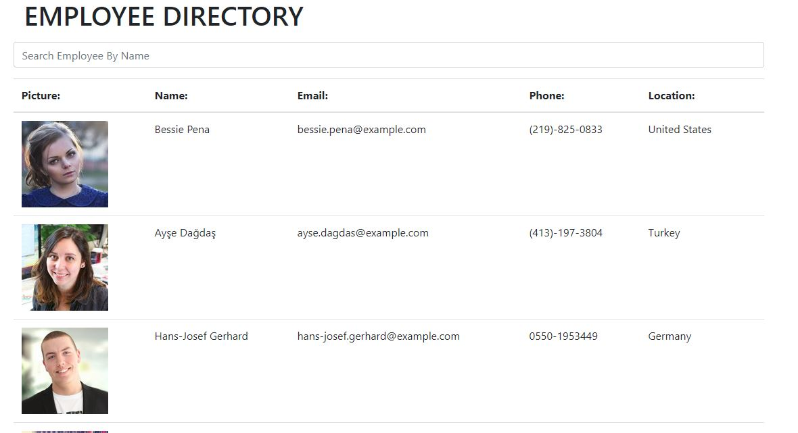

# Employee-directory

## Table of Contents
- [Description](#description)
- [Display](#display)
- [Installation](#installation)
- [Usage](#usage)
- [Contributing](#contributing)
- [Questions](#questions)

## Display

 

## Description

A list of random employees from the API 'https://randomuser.me/api/'

## Installation
For link to Heroku Web Application click [https://git.heroku.com/morning-badlands-31955.git]()

## Usage
run npm install to verify all the dependencies needed

## Contributing
Have any ideas how to make improvements please feel free to fork or comment!

## Questions
GitHub: @kmsaunders7
email: kmsaunders7@gmail.com
